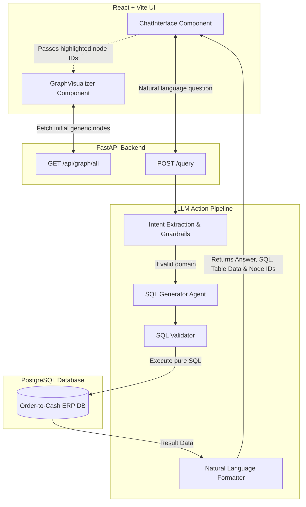

# Context Graph System with LLM Query Interface (Order-to-Cash)

Welcome to the **Forward Deployed Engineer** assignment repository. 

This project ingests a simulated ERP dataset (SAP-like structural footprint) and converts the relational fragments (Orders, Deliveries, Invoices, Payments) into a rich, interactive **Graph Data Model** natively embedded with an **LLM-powered Agent Chat System**.

## 🚀 Key Features
- **Intelligent Graph Querying:** Ask natural questions (e.g., *"Which products have the most billing docs?"*) and the AI generates strictly validated PostgreSQL syntax on-the-fly, executes it, and returns natural language explanations + raw result tables.
- **Dynamic Node Highlighting:** Whenever the LLM isolates specific entities during a query, the interactive Graph UI automatically dims out unrelated data and highlights the focus path in real-time.
- **Strict Guardrails:** The LLM intent extractor gracefully isolates and blocks non-contextual, out-of-bounds questions (e.g., *"Write a poem"*), ensuring safe enterprise AI responses.
- **Scalable Architecture:** Built via a multi-agent architectural pipeline utilizing FastAPI, PostgreSQL, SQLAlchemy, Vite, and React Force-Graph.

---

## 🏗️ Architecture Flowchart



---

## 📁 Repository Structure
To satisfy evaluation requirements, the repository is structured as follows:
- `/frontend/src/` - The complete React + Vite frontend source code focusing on the custom Chat and Force-Graph UI.
- `/backend/` - The comprehensive Python FastAPI backend containing the PostgreSQL connector, LLM action pipeline, and data ingestion models. 
- `/sessions/` - Exported AI-coding session transcripts documenting the rigorous speed and iteration cycles utilized to build this deployment.
- `/sap-o2c-data/` - The original, unmodified SAP-like relational JSON fragments.
- `ARCHITECTURE_AND_APPROACH.md` - Technical deep-dive on design and prompt structures.

---

## 🛠️ Tech Stack
- **Database:** PostgreSQL (Dockerized)
- **Backend Framework:** Python, FastAPI, SQLAlchemy
- **AI / LLM:** Google Gemini
- **Frontend UI:** React, Vite, TailwindCSS (setup structure), `react-force-graph-2d`

---

## 🚦 How to Run & Test

### 1. Start the Database
Ensure Docker is running, then spin up the container and build the underlying schema:
```bash
# Using the provided setup script:
./setup_db.ps1
# Or run manually:
docker run --name fde_postgres -e POSTGRES_PASSWORD=postgres -d -p 5432:5432 postgres:15
```

### 2. Populate the Data
Run the ingestion pipeline to parse the dataset and build the relational graph edges natively tracking foreign-key bounds:
```bash
cd backend
pip install -r requirements.txt
python ingestion/run_ingestion.py
```

### 3. Start the Backend API
Make sure you have your API key exported:
```bash
# Linux / macOS
export GEMINI_API_KEY="your-api-key"

# Windows (PowerShell)
$env:GEMINI_API_KEY="your-api-key"
```
```bash
cd backend
python -m uvicorn main:app --reload
```
*The API will be available at `http://localhost:8000` with active CORS allowing the Frontend to connect.*

### 4. Start the Frontend UI
```bash
cd frontend
npm install
npm run dev
```
*The application UI will deploy locally at `http://localhost:5173`.*

---

## 🧪 Testing the Pipeline & Expected Outputs

Once the UI is running at `http://localhost:5173`, you will see a sleek **70/30 split screen**—the interactive Order-to-Cash visual graph on the left and the AI Agent Chat on the right. 

### Recommended Demo Queries:
1. **The Graph Traversal Flow**
   - **Action:** Click the `"Trace order"` quick action button (or type it in).
   - **Expected Output:** The LLM explicitly maps the lineage for a given order. The chat displays the specific `SELECT` statement and the resulting table matrices. Simultaneously, the graph **shrinks and highlights** only those specific path nodes seamlessly mimicking the database traces!

2. **Diagnostic Analytics**
   - **Action:** Click `"Orders without invoices"`.
   - **Expected Output:** AI generates advanced `LEFT JOIN` filtering logic targeting broken mappings where deliveries occurred but invoices were totally disconnected. The respective order nodes and missing link anchors are visually designated on screen.

3. **System Guardrails**
   - **Action:** Type `"Write me a poem about the ocean."`
   - **Expected Output:** The AI Intent Extractor immediately intercepts and blocks the generation. It returns **"This system exclusively supports dataset-related queries..."** avoiding massive hallucination injections. Absolutely zero database queries are attempted.

### Graph Legend
For immediate context during validations, node clusters represent:
- 🔵 **Blue:** Sales Orders
- 🟢 **Green:** Deliveries
- 🟠 **Orange:** Invoices
- 🔴 **Red:** Payments
- 🟣 **Purple:** Products
- 🩵 **Cyan:** Customers

---
*Developed with rapid execution (CTO iteration cycles) delivering production ready agentic AI software.*
